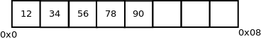
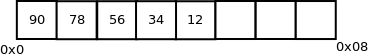
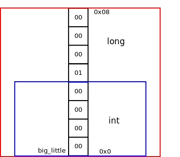
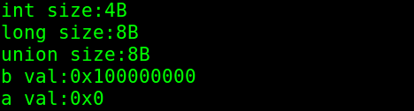

## 大端小端

### 大端模式（Big-Endian）
是指数据的高字节保存在内存的低地址中，而数据的低字节保存在内存的高地址中，
这样的存储模式有点儿类似于把数据当作字符串顺序处理：地址由小向大增加，而数据从高位
往低位放；这和我们的阅读习惯一致。(PowerPC)

### 小端模式
是指数据的高字节保存在内存的高地址中，而数据的低字节保存在内存的低地址中，
这种存储模式将地址的高低和数据位权有效地结合起来，高地址部分权值高，低地址部分权值低。(x86)

如 存储一个数值：0x1234567890，那么在大端上： 

 

那么在小端上： 

 

如何证明自己的平台是大端还是小端？

<a href="./src/big_or_little_endian.c">代码证明</a>

我的硬件平台是x86，属于小端模式，因此以此为例，简单介绍代码实现：

因为联合体的大小是由其大小最大的那个成员决定，因此用联合体证明大小端是较为便捷的方式。
建立联合体：

~~~
union {
    int a,
    long b,
}big_little;
~~~

蓝色区域是int， 红色区域是long。当成员b为1<<32时，联合体在内存存储方式就如下图： 

 

当输出成员a时，就如图显示为0。

 
