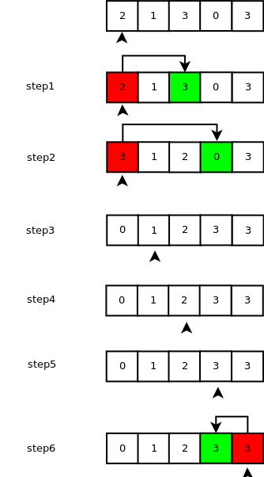

##topic3 数组中的重复数字

### 题目一 数组中的重复数字

#### 描述
&nbsp;&nbsp;&nbsp;&nbsp;&nbsp;&nbsp;&nbsp;在一个长度为n的数组里面的所有数字都在0～n-1的范围内。数组中某些数字可能是重复的，请找出数组中**任意**一个重复的数字。

#### 常规思路
1. 从头到尾扫描排序后的数组就可以了。 时间复杂度O(nlog(n))。 
2. 桶排序。时间复杂度O(n)，空间复杂度O(n)。

#### 分析
&nbsp;&nbsp;&nbsp;&nbsp;&nbsp;&nbsp;&nbsp;这个题的最大的特点是**在一个长度为n的数组里面的所有数字都在0～n-1的范围内。**所以，当这个数字排序后并无重复数字时，下标值等于对应数组元素值。

#### 思路

在扫描数组时
1. 如果下标值i等于对应数组元素值m，则接着扫描一个数字；
2. 如果不相等，则比较下标值i和下标值m的数组元素值，若相等则找到一个重复的数字
3. 如果依然不相等，就把第i个元素和第m个元素交换，这时第m个元素满足下标值等于对应数组元素值，但交换后第i个元素不一定满足，所以接着循环第3条，直至都满足条件扫描下一个或者找到重复数字结束。

以{2, 1, 3, 0, 3}为例:

#### 测试用例

1. 有重复数字
2. 无重复数字
3. 空指针

#### 代码

<a href="../src/topic3.c">源代码</a>

### 题目二 不修改数组找出重复的数字

#### 描述

&nbsp;&nbsp;&nbsp;&nbsp;&nbsp;&nbsp;&nbsp;在一个长度为n+1的数组里的所有数字都在1～n的范围内，因此，所有数组中至少有一个数组是重复的。请找出中任意一个重复的数字，但不能修改输入的数组。

#### 分析

&nbsp;&nbsp;&nbsp;&nbsp;&nbsp;&nbsp;&nbsp;若没有重复的数字，那么从1～n范围中只有n个数。所以，根据元素值将数组分成两组：1～m和m+1～n（m =（1+n）/ 2 ）,统计这个两个部分的个数。

&nbsp;&nbsp;&nbsp;&nbsp;&nbsp;&nbsp;&nbsp;若前者个数大于m，那么重复的数肯定在前者；否则肯定在后者。

&nbsp;&nbsp;&nbsp;&nbsp;&nbsp;&nbsp;&nbsp;缺陷在于若1～m范围中，数组元素为1, ..., m-2, m-1, m-1，这时1～m范围个数依旧是m个但有重复数字。

#### 代码

<a href="../src/topic3_change1.c">源代码<a>

### 总结

根据**功能要求不同**（若要找出全部重复的数字，则上述算法得到正确结果的）和**性能要求**（时间效率优先还是空间效率优先），那么我们最终选取的算法也将不同
