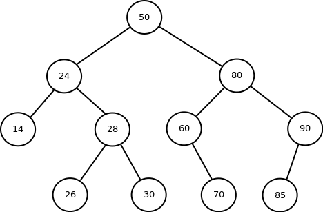
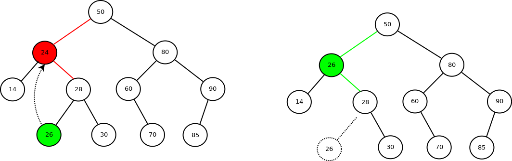

## 二叉搜索树

&nbsp;&nbsp;&nbsp;&nbsp;&nbsp;&nbsp;&nbsp;&nbsp; 二叉搜索树是以一棵二叉树来组织的，其中除了包含最基本的表示节点左右孩子的元素left，right之外，应有表示关键字的元素key。二叉搜索树中的关键字总是以满足二叉搜索树性质的方式来存储的：**设x是二叉搜索树中的一个节点，如果y是x左子树中的一个节点，那么y.key <= x.key；如果y是右子树中的一个节点，那么y.key >= x.key。**

&nbsp;&nbsp;&nbsp;&nbsp;&nbsp;&nbsp;&nbsp;&nbsp; 所以，根据二叉搜索树的性质， 通过中序遍历，可以得到一组有序的数组。

### 操作

#### 查询

1. minimum（查找最小值） 
   根据二叉搜索树的性质，最左节点是最小值节点。

2. maximum（查找最大值） 
   根据二叉搜索树的性质，最左节点是最小值节点。

3. successor（查找某个节点的前驱节点） 
   某节点的前驱节点： 是最邻近这个节点的key值但比key值小的节点。在二叉搜索树中，某节点的前驱节点是这个节点的左子树中最右边的节点。

4. predecessor（查找某个节点的后继节点） 
   某节点的前驱节点： 是最邻近这个节点的key值但比key值大的节点。在二叉搜索树中，某节点的后继节点是这个节点的右子树中最左边的节点。

5. search（查找是否存在）

#### 其他

1. 初始化创建

2. 增加新节点
   依照二叉搜索树的性质，遍历树，将新节点添加到相应的叶子节点上。

3. 删除节点（比较麻烦） 
   a. 若没有孩子节点，那么只是简单地将它删除，并修改他的父节点，用NULL作为孩子节点代替原来的。（如删除14， 26节点）
   b. 若只有一个孩子节点，那么将这个孩子提升到树中要删除节点的位置上，并修改删除节点的父节点，用删除节点的孩子代替删除节点。（如90，60节点）
   c. 若有两个孩子，那么找删除节点的后继节点（已知道是删除节点右子树的最左孩子），并让后继节点占据删除节点的位置，这时后继节点的右子树继承了删除节点的右子树，删除节点的父节点相应的子节点指向了此时的后继节点。（如24,80）

红色线表示将要改变的节点间的关系，红色节点表示要删除的节点。 
绿色线表示已经改变了节点间的关系，绿色节点表示改变了的节点。 

### 定理
1. 如果x是一棵有n个节点子树的根，那么遍历一次需要耗费的时间为O(n)。
2. 在一棵树高为h的二叉搜索树，动态集合上操作minimum（查找最小值）， maximum（查找最大值）， successor（查找某个节点的前驱节点）， predecessor（查找某个节点的后继节点）和search（查找是否存在）都可以在O(h)时间内完成。
3. 在一棵树高为h的二叉搜索树，动态集合上操作insert（添加一个新节点）和detele（删除一个节点）都可以在O(h)时间内完成。

### 缺点
严重依赖输入数据序列，若这个输入数据序列基本有序，那么二叉搜索树将退化为链表；但若这个输入数据序列基本乱序，那么二叉搜索树树高最低，相应效率最高，见定理2,3 
改进：如平衡二叉搜索数，红黑数等等。。

### 参考
《算法导论》
慕课算法课程
