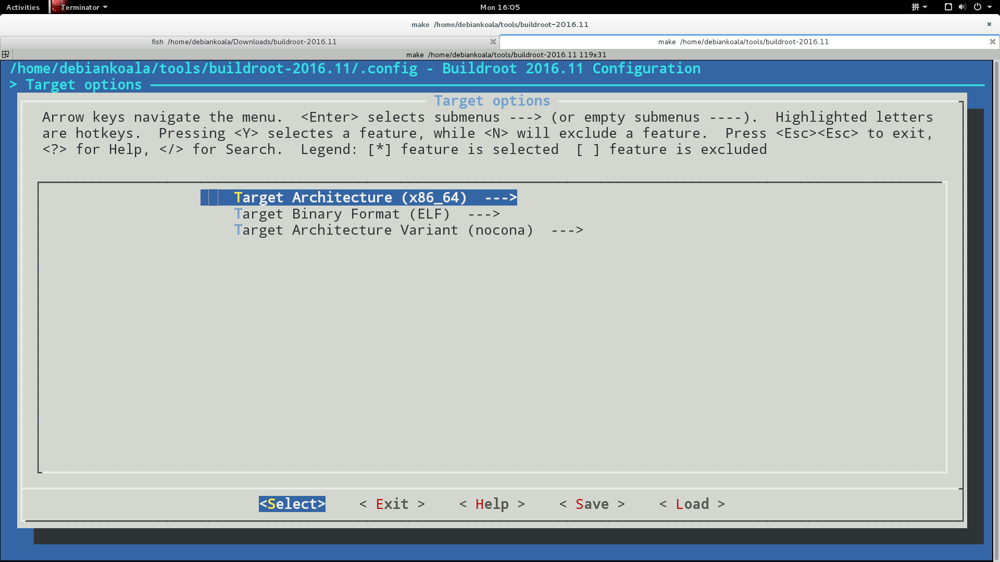
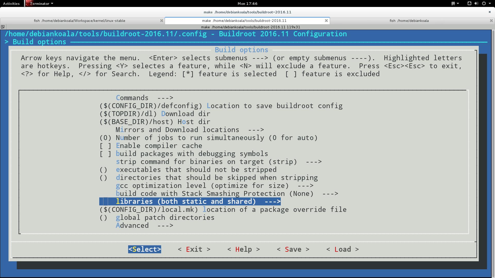
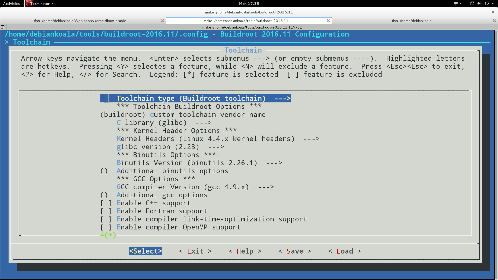
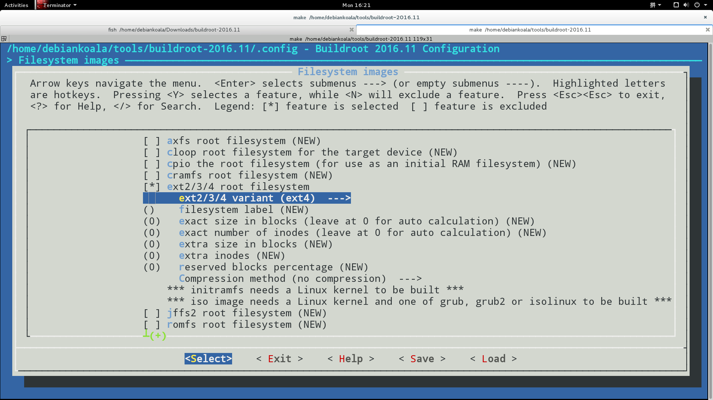
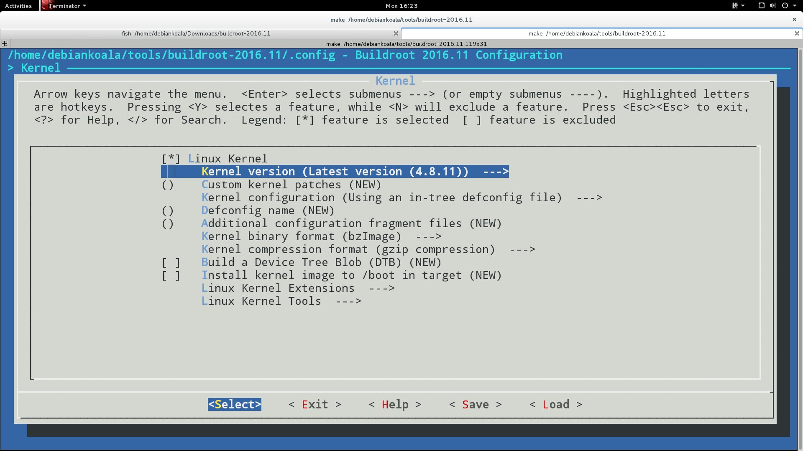
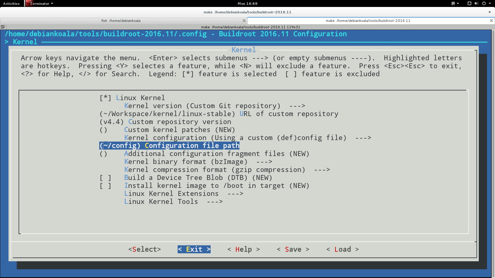
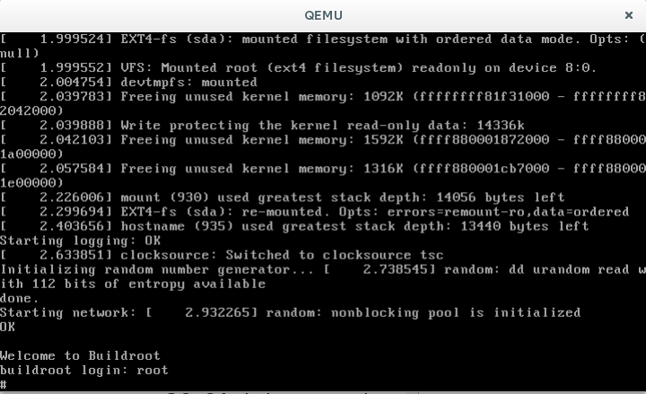

## qemu & buildroot 建立x86调试环境

本文只针对模拟x86环境

### 本机环境:

操作系统:Debian GNU/Linux 8.6 (jessie) 
CPU 架构: Intel(R) Core(TM) i5-4570 CPU @ 3.20GH

### qemu
##### 简介

QEMU是一套由Fabrice Bellard所编写的模拟处理器的自由软件。其中的System mode模拟模式，亦即是系统模式。QEMU能模拟整个电脑系统，包括中央处理器及其他周边设备。它使得为系统源代码进行测试及除错工作变得容易。其亦能用来在一部主机上虚拟数部不同虚拟电脑。

##### 安装qemu
1 直接通过apt-get安装 

  ~~~
  sudo apt-get install qemu
  ~~~

2 qemu源码安装 

step1 qemu源码下载:[http://wiki.qemu.org/Download](http://wiki.qemu.org/Download)(建议不要下载最新版本,出现问题较难以解决)

step2 编译&安装  

~~~
tar -jx -f qemu-2.7.0.tar.bz2
cd qemu-2.7.0
./configure
make
sudo make install
~~~

### buildroot

##### 简介

Buildroot is a simple, efficient and easy-to-use tool to generate embedded Linux systems through cross-compilation.

##### 安装buildroot

step1 buildroot源码下载:[https://buildroot.org/](https://buildroot.org/)

step2 配置buildroot,是最复杂的一步.

a)进入配置界面,如图:

~~~
make menuconfig
~~~

 

b) 配置目标结构:x86_64
在Target options--> Target Architecture目录中, 选择"x86\_64"
 

c) 配置库文件:静态库和动态库

在Build options-->Libraries目录中,选择"both static and shared" 
(注:只选择shared only,不是buildroot编译的bzImage是不识别的.)

 

d) 配置工具链:主要有C库文件,kernel头文件和gcc版本.

- 在Toolchain-->C library目录中,配置C库文件,选择"glibc"

- 在Toolchain->kernel headers目录中,配置kernel头文件.我-要使用linux-4.4的内核版本,所以选择"Linux 4.4.x kernel headers"

- 在Toolchain-->Gcc Compiler Version目录中,配置gcc版本.根据要编译的内核对应的gcc的版本.这里我选择的是"gcc 4.9.x" 

 

e) 配置文件系统:ext3或是ext4.buildroot默认是ext2
在Filesystem images->ext2/3/4 root filesystem 选择使能这个选项,之后会出现ext2/3/4 variant目录,选择"ext4".
 

f)配置编译的内核:如linux-4.4

- 在Kernel目录中,先选择Linux Kernel,这样可以自定义内核版本.之后会出现很多选项:
 

- 在Kernel Version选项中选择:
若选择"Custom Git repository",那么在URL of custom repository选项中写入linux git源码本地的仓库:"~/linux-stable".(注:在[linux source git repostiory](https://www.kernel.org/pub/scm/linux/kernel/git/stable/linux-stable.git),可以获取到linux所有稳定版本的源码git仓库).并且"Custom repository version"中写入想要的版本号.如"v4.4"(注,在下载好的本地的git仓库中,通过git tag查看想要的版本号和名称).**OR** 若选择"Custom version",那么"Kernel version"写入下载好的内核(注,可在[kernel.org](kernel.org)中获取)
- 在"Kernel configuration"中, 选择"Using a custom (def)config file",这样可以自定义内核的配置文件.并需要在"Configuration file path"选项中写入配置好linux内核源码的config文件,如"~/config"

 

g)保存退出

h) 编译
~~~
make -j4 (与逻辑cpu有关)
~~~
i) 编译完成后多出现output目录(现在在buildroot目录中),其中output/images/root.ext2是buildroot生成的根文件系统,这时这个根文件镜像,可以被其他bzImage挂载.output/images/bzImage是编译好的linux镜像.  output/images/target是根文件系统中的文件.

j)rootfs.ext2只是 **最基本的根文件系统**,若需要添加更多的功能,则得另加选项.

### qemu 建立x86仿真环境
###### 利用buildroot中的bzImage linux镜像
buildroot中,已经编译特定版本的linux的bzImage镜像.因此通过:(已经在buildroot根目录下)

~~~
qemu-system-x86_64 -hda output/images/rootfs.ext2  -kernel output/images/bzImage  -m 1024M -append "root=/dev/sda"
~~~
可以建立x86仿真环境.

###### 利用其他bzImage linux镜像
上文已经提到在同时选择静态库和共享库后,生成的根文件系统镜像可以重复使用.假如在其他linux源码下编译了bzImage镜像.建立x86仿真环境:

~~~
qemu-system-x86_64 -hda ~/Workspace/kernel/linux-stable  -kernel output/images/bzImage  -m 1024M -append "root=/dev/sda" smp=1(单核，>1多核)
~~~

qemu刚启动时,qemu中只有root用户,且无密码.

### buildroot 与 busybox
Busybox: The Swiss Army Knife of Embedded Linux，and it combines tiny versions of many common UNIX utilities into a single small executable. It provides replacements for most of the utilities you usually find in GNU fileutils, shellutils, etc. The utilities in BusyBox generally have fewer options than their full-featured GNU cousins; however, the options that are included provide the expected functionality and behave very much like their GNU counterparts. BusyBox provides a fairly complete environment for any small or embedded system.

buildroot 相对于busybox,省去了手动添加配置文件等过程,buildroot中不仅集成busybox,还有其他很多使用的工具.buildroot还是很容易的.
