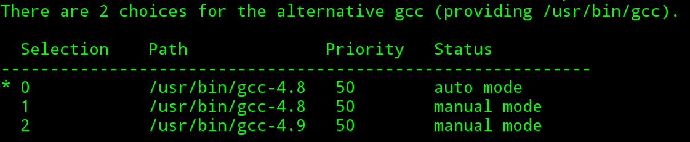

## update-alternatives管理工具来进行版本控制

本文以gcc为例

### 现象
最近小koala在Linxu环境下遇到这样的一个问题，某个工具的编译需要特定的Gcc版本，但是又不想卸载掉默认的Gcc版本，一来是怕重新安装出现依赖错误，二来是可能这个Gcc版本只是临时需要，并不值得永远替换掉当前系统默认的版本。

### 解决方法----update-alternatives

update-alternative 在man手册中是这样解释的：该工具是用来维护默认命令的符号链接。也就是说用来维护多个gcc版本中，默认用来编译文件的gcc工具的链接。

注意：update-alternatives只能暂时临时变更gcc版本。

gcc -v 可知道当前系统gcc的版本，如我： gcc version 4.9.2 (Debian 4.9.2-10)

但现在我需要gcc-4.8怎么办？下面介绍如何临时变更gcc版本：

- step1 安装gcc-4.8

  ~~~
	sudo apt-get install gcc-4.8
  ~~~

- step 2 利用update-alternatives变更gcc版本：

	command format: update-alternatives --install link name path priority
	link : gcc命令的链接的绝对路径。
	name ： 命令的名字，即gcc。
	path ： gcc各个版本的链接的绝对路径。
	priority : 将要设置的gcc版本的优先级。在update-alternatives中每个版本的gcc都有一个优先级，用来判别用户最需要那个版本的gcc。但需用户自己设置。数值大的表示优先级高。

  ~~~
  sudo update-alternatives --install /usr/bin/gcc gcc /usr/bin/gcc-4.8 50
  ~~~

  注意：系统原来版本的gcc也需要运行以上命令。

  这样就将多个版本的链接添加到默认链接管理器中了，通过一下命令来查看：

  ~~~
  sudo update-alternatives --config gcc
  ~~~

  

  指示当前系统的gcc版本。这时我选择2 gcc-4.9

  

现在系统的gcc版本已经切换啦。

注释： xiaokoala使用debain 8.6 发行版。可能linux发行版命令格式有不同。
这个是我师兄在ubuntu 15.04中的使用说明： [ubuntu 15.04 update-alternatives使用说明](http://www.chpstik.com/2016/11/04/%E5%A6%82%E4%BD%95%E5%9C%A8%E5%90%8C%E4%B8%80%E4%B8%AAlinux%E5%8F%91%E8%A1%8C%E7%89%88%E4%B8%AD%E4%BD%BF%E7%94%A8%E5%A4%9A%E5%A5%97%E5%BC%80%E5%8F%91%E5%B7%A5%E5%85%B7/)。也是我参考的文档，有不少雷同。
